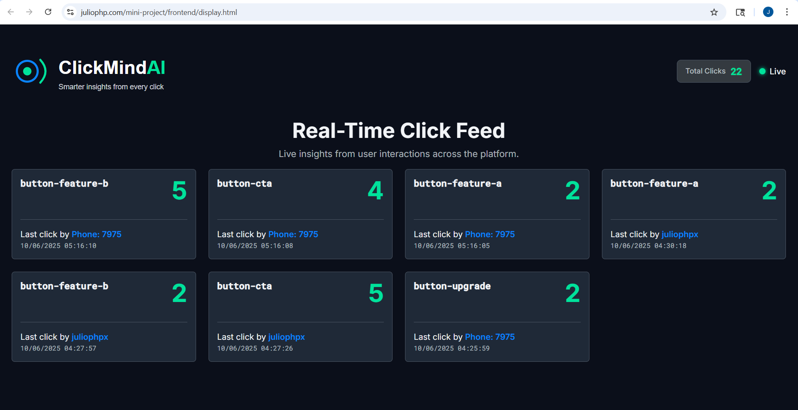

# ClickMindAI – Smarter insights from every click

<p align="center">
  
  <br />
  <em>Smarter insights from every click</em>
  <br /><br />
</p>

A minimalist full‑stack demo that tracks per‑user button clicks in real time, streams updates to a public display, and generates an AI insight from the data. Built with vanilla technologies for clarity and control: HTML/CSS/JS on the frontend and PHP/MySQL on the backend.

- Live Dashboard (auth required): https://juliophp.com/mini-project/frontend/dashboard.html
- Live Usage Display (public): https://juliophp.com/mini-project/frontend/display.html
- API Base URL: https://juliophp.com/mini-project/backend/api/
- Repository: https://github.com/Juliophpx/mini-project

## Screenshots

### Dashboard


### Real‑Time Display


### AI Insight


## What this project demonstrates

- Passwordless authentication via email or SMS code (SendGrid + Twilio Verify)
- Auto‑provisioning users on first login
- Per‑user click tracking stored in MySQL
- Real‑time usage display via Server‑Sent Events (SSE)
- AI-generated insight (OpenAI) from the aggregated click data
- Clean separation: static frontend + REST API backend
- No heavy frameworks, minimal dependencies, high transparency

## Architecture overview

- Frontend (static)
  - Vanilla HTML/CSS/JS
  - `dashboard.html` (authenticated) – buttons send clicks to the API
  - `display.html` (public) – real-time feed over SSE
  - Config: `frontend/js/config.js` sets `API_BASE_URL`

- Backend (API)
  - Vanilla PHP + PDO (MySQL)
  - JWT auth (HS256), access + refresh tokens
  - Passwordless login (email OTP or SMS code)
  - Click tracking endpoint + SSE stream endpoint
  - AI endpoint calling OpenAI
  - Config via `backend/api/.env`

- Database
  - MySQL schema in `backend/api/sql/clickmind.sql`

## Directory layout

```
frontend/
  dashboard.html
  display.html
  js/
    auth.js         # token validation, refresh, logout
    config.js       # API_BASE_URL (point to your API)
    dashboard.js    # UI logic + clicks/track
    display.js      # SSE client for real‑time display
backend/
  api/
    index.php       # CORS, session/csrf setup, routes include
    routes.php      # Router -> endpoints
    endpoints/
      auth/         # login_email, login_sms, verify_*, refresh, logout, validate_token
      clicks/       # track (POST), stats (GET SSE)
      ai/           # analyze_clicks (OpenAI)
    helpers/        # auth.php (JWT), db.php (PDO), csrf.php, etc.
    config/         # *_config.php
    sql/
      clickmind.sql # database schema + sample data
```

## Quick start (local or shared hosting)

1) Requirements
- PHP 8.x with PDO MySQL
- MySQL 5.7+/MariaDB
- Ability to serve static files for the frontend (any web server)

2) Database
- Create a database and import `backend/api/sql/clickmind.sql`.

3) Backend config
- Copy `backend/api/.env.example` to `backend/api/.env` and fill in:
  - `DB_HOST`, `DB_PORT`, `DB_NAME`, `DB_USER`, `DB_PASS`
  - `JWT_SECRET_KEY`, `JWT_TOKEN_EXPIRATION`, `JWT_REFRESH_TOKEN_EXPIRATION`
  - `SENDGRID_API_KEY`, `TWILIO_ACCOUNT_SID`, `TWILIO_AUTH_TOKEN`, `TWILIO_VERIFY_SERVICE_SID`
  - `OPENAI_API_KEY`
  - `CORS_ALLOWED_ORIGINS` (comma separated, no spaces). Example:
    `CORS_ALLOWED_ORIGINS=http://localhost:8080,https://your-frontend.example`

  Notes:
  - The API sets cookies for cross-site CSRF support. If you deploy on a different domain, adjust cookie domain in `backend/api/index.php` if needed.
  - Do not commit real secrets. `.env` is not versioned.

4) Frontend config
- Edit `frontend/js/config.js` and set:
  ```js
  const API_BASE_URL = 'https://your-host/mini-project/backend/api/';
  ```

5) Serve
- Host `frontend/` as static files (any static hosting or same PHP server).
- Host `backend/api/` under a PHP-capable server path (e.g., `.../backend/api/`). The API entry is `index.php`.

6) Try it
- Open the Dashboard: `/frontend/dashboard.html`
  - Log in with email or phone. You’ll receive a one-time code (SendGrid/Twilio Verify).
  - After verifying, you’ll get `{ access_token, refresh_token, user }` and the user is auto‑created if new.
  - Click the buttons to record clicks.
- Open the Display: `/frontend/display.html`
  - Shows real‑time per-user click counts over SSE. No auth required.
- Get AI Insight (Dashboard)
  - Click “Get AI Insight” to call the OpenAI‑backed endpoint. Make sure your `OPENAI_API_KEY` is set.

## Authentication flow (passwordless)

- Email login
  - POST `auth/login_email` with `{ email }` → server sends a code via SendGrid
  - POST `auth/verify_email` with `{ email, code }` → returns `{ access_token, refresh_token, user }`
- SMS login
  - POST `auth/login_sms` with `{ phone }` → server triggers Twilio Verify
  - POST `auth/verify_sms` with `{ phone, code }` → returns `{ access_token, refresh_token, user }`
- Token validation
  - GET `auth/validate_token` with `Authorization: Bearer <access_token>`
- Refresh
  - POST `auth/refresh` with `{ refresh_token }` → returns new `{ access_token, refresh_token }`
- Logout
  - POST `auth/logout`
    - Headers: `Authorization: Bearer <access_token>`, `X-Csrf-Token: <csrf-token>`
    - Body: `{ "refresh_token": "...", "invalidate_all": true }`
  - CSRF token fetched from `GET csrf/token` and sent in the header for state‑changing requests.

Frontend helpers
- `frontend/js/auth.js` automatically validates tokens on load, handles refresh flow, and exposes `window.handleLogout()` which:
  - fetches `csrf/token`
  - POSTs to `auth/logout` with the refresh token (cookie and/or localStorage)
  - clears local session and redirects to login

## Click tracking and real time

- Track a click (Dashboard)
  - POST `clicks/track` with `Authorization: Bearer <access_token>` and `{ button_id }`
- Real‑time stream (public)
  - GET `clicks/stats` (SSE)
  - `frontend/js/display.js` connects with `EventSource` and updates the UI live
  - Includes reconnection logic and cache‑busting to be resilient on shared hosts

## AI insight

- GET `ai/analyze_clicks`
  - Aggregates click counts and asks OpenAI for an actionable insight
  - Configure `OPENAI_API_KEY` in `backend/api/.env`

## Security notes

- JWT (HS256) with server‑side verification; secrets in `.env`
- Access token lifetime and refresh token lifetime are configurable
- Refresh tokens stored in DB; can be invalidated one‑by‑one or all for a user
- CSRF protection enforced on state‑changing endpoints; token provided by `GET csrf/token` and sent via `X-Csrf-Token`
- CORS controlled via `CORS_ALLOWED_ORIGINS` in `.env`
- Cookies configured with `SameSite=None; Secure` for cross‑site CSRF flow when needed
- SSE endpoint releases PHP session locks and disables buffering to support stable streams

## Environment variables (backend/api/.env)

Example keys (do not commit real credentials):

```
DB_HOST=localhost
DB_PORT=3306
DB_NAME=clickmind
DB_USER=your_user
DB_PASS=your_pass

JWT_SECRET_KEY=change_me
JWT_TOKEN_EXPIRATION=3600
JWT_REFRESH_TOKEN_EXPIRATION=604800

SENDGRID_API_KEY=SG.xxxxxx
CORS_ALLOWED_ORIGINS=http://localhost:8080,https://your-frontend.example

TWILIO_ACCOUNT_SID=ACxxxxxxxx
TWILIO_AUTH_TOKEN=xxxxxxxx
TWILIO_VERIFY_SERVICE_SID=VAxxxxxxxx

OPENAI_API_KEY=sk-xxxxxxxx
```

## API overview

- Auth
  - `POST auth/login_email` → start email OTP
  - `POST auth/verify_email` → exchange code for tokens
  - `POST auth/login_sms` → start SMS OTP
  - `POST auth/verify_sms` → exchange code for tokens
  - `GET auth/validate_token` → validate access token
  - `POST auth/refresh` → refresh tokens
  - `POST auth/logout` → invalidate refresh token (and optionally all)
- Clicks
  - `POST clicks/track` → increment per‑user `button_id`
  - `GET clicks/stats` → SSE stream of aggregated per‑user/button counts
- AI
  - `GET ai/analyze_clicks` → OpenAI‑generated short business insight

## Deployment notes

- Frontend: any static hosting (Firebase Hosting, S3/CloudFront, Netlify, GitHub Pages with API elsewhere). Update `frontend/js/config.js`.
- Backend: any PHP hosting (shared hosting, VPS). Ensure:
  - `.env` is present and not public
  - CORS origins include your frontend
  - SSE supported (avoid aggressive buffering/compression)
  - Session cookie domain updated if needed in `backend/api/index.php`
- Database: managed MySQL instance or same host

## Troubleshooting

- SSE doesn’t update after refresh
  - Confirm no server buffering/proxy caching
  - The SSE handler disables compression and releases session locks; still, some hosts need extra config
- 403 on state‑changing requests
  - Ensure you fetch `GET csrf/token` with `credentials: 'include'` and send `X-Csrf-Token`
- CORS errors
  - Add your frontend origin to `CORS_ALLOWED_ORIGINS` (no spaces, comma‑separated)
- Email/SMS not received
  - Verify SendGrid sender is authorized; Twilio Verify service configured correctly
- OpenAI errors
  - Check `OPENAI_API_KEY` and network egress

---

ClickMindAI – Smarter insights from every click.
